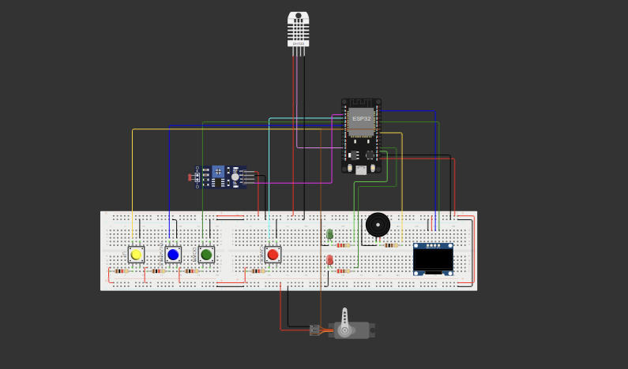

# Smart MediBox

The **Smart MediBox** is an embedded systems project designed to provide an intelligent medicine storage solution with features such as time-synced alarm notifications, environmental monitoring, and remote interaction through MQTT and Node-RED.

## Project Overview

This project leverages the ESP32 microcontroller to build a smart medicine box that manages alarms, monitors environmental conditions, and adjusts light exposure. It also integrates with **Node-RED** for real-time data visualization and remote interaction.




## Features

### Core Functionalities
- **Time Synchronization:** Syncs with NTP servers with timezone configuration.
- **Alarm Management:** Create, manage, and disable medication alarms.
- **OLED Display:** Shows time, system status, and alarm notifications.
- **Audible Alerts:** Buzzer activates during alarms; stopped by push buttons.
- **Environmental Monitoring:** Tracks temperature and humidity levels.
- **Light Monitoring:** LDRs measure ambient light intensity.
- **Servo Motor Control:** Adjusts a shaded window based on light intensity and medicine requirements.

### Advanced Functionalities
- **Persistent Storage:** Saves alarms and user preferences to non-volatile memory.
- **User Interface:** Menu-based navigation via OLED and push buttons.
- **Change Detection:** Efficient sensor polling to reduce power usage.
- **Continuous Monitoring:** Always-on sensors with real-time dashboard updates.

## System Architecture

### Modules
- **Hardware Abstraction Layer:** Simplifies interactions with physical components.
- **Sensor Management:** Handles data from DHT (Temp/Humidity) and LDRs.
- **Alarm Management:** Stores and triggers alarms.
- **Time Management:** Handles time sync and local offset.
- **User Interface:** Menu-driven interaction via buttons and OLED.
- **Communication Management:** Publishes/subscribes MQTT topics for remote control and monitoring.

## 🔧 Hardware Requirements

| Component                 | Description                          |
|--------------------------|--------------------------------------|
| ESP32 Development Board  | Microcontroller with WiFi/Bluetooth  |
| OLED Display             | 128x64 display for interface         |
| Buzzer                   | Audible notification device          |
| Push Buttons             | User input for control               |
| LDRs                     | Light intensity sensors              |
| Servo Motor              | Controls shaded window               |

## Software Requirements

- [Arduino IDE](https://www.arduino.cc/en/software)
- [Wokwi Simulator](https://wokwi.com/)
- [Node-RED](https://nodered.org/)
- MQTT Broker (e.g. `test.mosquitto.org`)
- VSCode (Optional for advanced editing)

## Installation & Setup

### Hardware Installation

Connect the components as specified in the Port Map.

1. Clone the repository:
   ```bash
   git clone https://github.com/lahirunie-dulsara/Smart-Medibox
2. Set up the hardware for the project from here.
3. Open Arduino IDE and upload the sketch.
4. Install Node-RED following the official documentation.
5. Import the Node-RED flow from the repository.

### Run the Project

1. Upload the firmware to the ESP32 development board.
2. Run the Node-RED server using the command:
   ```bash
   node-red
3. Open the Node-RED dashboard in the browser using the URL http://localhost:1880/ui.

   
### Simulation
Set up the Wokwi simulator for the project. The setup guide and simulation details can be found here.

### Dashboard
The Node-RED dashboard provides a user-friendly interface for visualizing and interacting with the MediBox system. Key features include:
- Real-time data visualization: Monitor light intensity, temperature, and humidity levels in real-time.
- User controls: Adjust light intensity parameters and control the servo motor via sliders and dropdowns.
- Historical data: View historical trends of sensor data to analyze environmental conditions over time.

### Contact
For any clarifications or inquiries, please feel free to contact me at [mihiruth@gmail.com](mailto:lahirdulsara@gmail.com).

